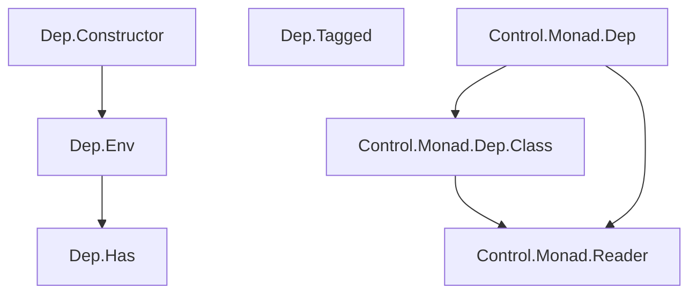

# dep-t

This package provides various helpers for the "record-of-functions" style of
structuring Haskell applications. 

A record that groups related functions is considered a component. Hypothetical example:

```
data Repository m = Repository
  { findById :: ResourceId -> m Resource,
    save :: Resource -> m ()
  } 
```

The record type is the component's "interface". A component's "implementation" is
defined by a constructor function that returns a value of the record type.

When starting up, applications build a dependency injection environment
which contains all the required components. And components read their *own* dependencies
from the DI environment. The DI environment is akin to an
[`ApplicationContext`](https://docs.spring.io/spring-framework/docs/current/javadoc-api/org/springframework/context/ApplicationContext.html)
in object-oriented frameworks like [Java
Spring](https://docs.spring.io/spring-framework/docs/current/reference/html/).

If components knew about the *concrete* DI environment, that would increase
coupling. Everything would depend on everything else. To avoid that, we resort
to `Has`-style typeclasses so that each constructor function knows only about the
parts of the environment that it needs, and nothing more. Those `Has`-style classes can
be tailor-made, but this package also provides a generic one. 

Hypothetical example of constructor function:

```
makeRepository :: (Has Logger m deps, Has SomeOtherDep m deps) => deps -> Repository m
```

*Very* loosely speaking, `Has`-style constraints correspond to [injected
constructor arguments](https://docs.spring.io/spring-framework/docs/current/reference/html/core.html#beans-constructor-injection) in object-oriented DI frameworks.

## Module structure



- __Dep.Has__ provides a generic `Has` typeclass for locating dependencies in an
environment. Usually, component implementations import this module.
- __Dep.Env__ complements __Dep.Has__ with helpers for building dependency injection environments. Usually, only the [composition root](https://stackoverflow.com/questions/6277771/what-is-a-composition-root-in-the-context-of-dependency-injection) of the application imports this module.
- __Dep.Tagged__ is a helper for disambiguating dependencies in __Dep.Env__ environments.
- __Dep.Constructor__ enables fixpoint-based dependency injection in __Dep.Env__ environments. See [this thread in the Haskell Discourse](https://discourse.haskell.org/t/dependency-injection-fixed-points-and-monoidal-accumulators/5557) for an example.
- __Control.Monad.Dep__ provides the `DepT` monad transformer, a variant of `ReaderT`. You either want to use this or __Dep.Constructor__ in your composition root, but not both.
- __Control.Monad.Dep.Class__ is an extension of `MonadReader`, useful to program against both `ReaderT` and `DepT`.

## Links

- This library was extracted from my answer to [this Stack Overflow
  question](https://stackoverflow.com/a/61782258/1364288).

- The implementation of `mapDepT` was teased out in [this other SO question](https://stackoverflow.com/questions/65710657/writing-a-zooming-function-for-a-readert-like-monad-transformer).

- An [SO
  answer](https://stackoverflow.com/questions/57703898/how-to-call-impure-functions-from-pure-ones/57714058#57714058)
  about records-of-functions and the "veil of polymorphism".

- The answers to [this SO
  question](https://stackoverflow.com/questions/61642492/simplifying-the-invocation-of-functions-stored-inside-an-readert-environment)
  gave me the idea for how to "instrument" monadic functions (although the
  original motive of the question was different).

- I'm unsure of the relationship between `DepT` and the technique described in
  [Adventures assembling records of
  capabilities](https://discourse.haskell.org/t/adventures-assembling-records-of-capabilities/623)
  which relies on having "open" and "closed" versions of the environment
  record, and getting the latter from the former by means of knot-tying. 

  It seems that, with `DepT`, functions in the environment obtain their
  dependencies anew every time they are invoked. If we change a function in the
  environment record, all other functions which depend on it will be affected
  in subsequent invocations. I don't think this happens with "Adventures..." at
  least when changing a "closed", already assembled record.

  With `DepT` a function might use `local` if it knows enough about the
  environment. That doesn't seem very useful for program logic; if fact it
  sounds like a recipe for confusion. But it enables [complex
  scenarios](https://www.baeldung.com/spring-abstract-routing-data-source) for
  which the dependency graph needs to change in the middle of a request.

  All in all, perhaps `DepT` will be overkill in a lot of cases, offering
  unneeded flexibility. Perhaps using `fixEnv` from `Dep.Env` will end up being
  simpler.

  Unlike in "Adventures..." the `fixEnv` method doesn't use an extensible
  record for the environment but, to keep things simple, a suitably
  parameterized conventional one.

- Another exploration of dependency injection with `ReaderT`:
  [ReaderT-OpenProduct-Environment](https://github.com/keksnicoh/ReaderT-OpenProduct-Environment).

- [The ReaderT design pattern](https://www.fpcomplete.com/blog/2017/06/readert-design-pattern/).

  > Your application code will, in general, live in ReaderT Env IO. Define it as type App = ReaderT Env IO if you wish, or use a newtype wrapper instead of ReaderT directly.

  > Optional: instead of directly using the App datatype, write your functions in terms of mtl-style typeclasses like MonadReader and MonadIO

- [RIO](http://hackage.haskell.org/package/rio) is a featureful ReaderT-like /
  prelude replacement library which favors monomorphic environments.

- The [van Laarhoven Free Monad](http://r6.ca/blog/20140210T181244Z.html).

  > Swierstra notes that by summing together functors representing primitive I/O
  > actions and taking the free monad of that sum, we can produce values use
  > multiple I/O feature sets. Values defined on a subset of features can be
  > lifted into the free monad generated by the sum. The equivalent process can
  > be performed with the van Laarhoven free monad by taking the product of
  > records of the primitive operations. Values defined on a subset of features
  > can be lifted by composing the van Laarhoven free monad with suitable
  > projection functions that pick out the requisite primitive operations. 

  [Another post](https://www.tweag.io/blog/2019-03-20-capability-free-monad/van) about the van Laarhoven Free Monad. Is it related to the final encoding of Free monads described [here](https://blog.poisson.chat/posts/2021-10-20-initial-final-free-monad.html)?

- [Interesting SO response](https://stackoverflow.com/a/634754/1364288) (from
  2009) about the benefits of autowiring in Spring. The record-of-functions
  approach in Haskell can't be said to provide true autowiring. You still need
  to assemble the record manually, and field names in the record play the part
  of Spring bean names. 

  > Right now I think the most important reason for using autowiring is that
  > there's one less abstraction in your system to keep track of. The "bean name"
  > is effectively gone. It turns out the bean name only exists because of xml. So
  > a full layer of abstract indirections (where you would wire bean-name "foo"
  > into bean "bar") is gone

- [registry](http://hackage.haskell.org/package/registry) is a package that
  implements an alternative approach to dependency injection, one different
  from the `ReaderT`-based one. 

- [Printf("%s %s", dependency, injection)](https://www.fredrikholmqvist.com/posts/print-dependency-injection/). Commented on [HN](https://news.ycombinator.com/item?id=28915630), [Lobsters](https://lobste.rs/s/4axrt6/printf_s_s_dependency_injection).

- [Dependency Injection Principles, Practices, and
  Patterns](https://www.goodreads.com/book/show/44416307-dependency-injection-principles-practices-and-patterns)
  This is a good book on the general princples of DI. 

- A [series of posts](https://twitter.com/ploeh/status/1485514524962738179)—by one of the authors of the DI book—about building a DI container.

- [Lessons learned while writing a Haskell
  application](https://gvolpe.com/blog/lessons-learned-while-writing-a-haskell-app/).
  This post recommends a "polymorphic record of functions" style, which fits
  the philosophy of this library.

- One [big disadvantage](https://www.reddit.com/r/haskell/comments/r6foxv/opinions_on_reader_continuationbased_io/hmthsoy/) of the records-of-functions approach:

  > representing effects as records of functions rather than typeclasses/fused effect invocations destroys inlining, so you’ll generate significantly worse Core if you use this on a hot path.

- [ReaderT pattern is just extensible effects](https://www.reddit.com/r/haskell/comments/sjhatp/readert_pattern_is_just_extensible_effects/)

